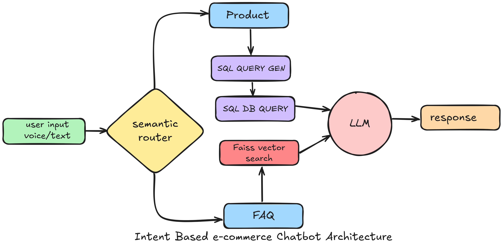

#  **🛍️ E-commerce AI Agent**
A smart conversational AI agent that revolutionizes online shopping through natural language interactions. Users can ask questions about products or general inquiries using both text and voice input, receiving instant, contextually relevant responses powered by advanced semantic search and routing.

### **Imagine a scenario:**
*Ayesha, a busy mom, needs new running shoes but doesn't have time to browse through hundreds of products. Instead of spending hours scrolling through pages, she simply asks:*

**"Show me women shoes under 2500 taka with good ratings"**

*Within seconds, the AI agent understands her intent, searches the product database, and presents her with the perfect matches along with ratings, prices, and direct purchase links - making her shopping experience effortless and efficient.*


## ✨ **Key Features**

### 🎤 **Multi-Modal Input**
- **Voice Commands**: Speak naturally to search for products
- **Text Input**: Traditional typing with intelligent understanding
- **Real-time Processing**: Instant responses to both input methods

### 🧠 **Intelligent Intent Routing**
- **Semantic Router**: Advanced NLP determines whether questions are about:
  - 📋 **FAQ Queries**: General store policies, shipping, returns, etc.
  - 🛒 **Product Search**: Specific product recommendations and details

### 📚 **Smart FAQ System**
- Vector-based semantic search using **FAISS**
- Instant answers to common questions about:
  - Payment methods and discounts
  - Shipping and delivery policies  
  - Return and exchange procedures
  - Store promotions and offers

### 🔍 **Advanced Product Discovery**
- **Natural Language Queries**: "Show me affordable smartphones with 64gb ram"
- **Smart Filtering**: Automatically handles price ranges, brands, categories
- **Direct Integration**: Real product links from e-commerce platform
- **Comprehensive Results**: Product details, ratings, prices, and sold amount

## Architecture Diagram


## 🛠️ **Technology Stack**

- **Frontend**: Streamlit with custom UI components
- **Vector Search**: FAISS for semantic similarity matching
- **Audio Capture**: Streamlit Mic Recorder (WebRTC-based browser recording)
- **Speech Recognition**: Openai-whisper
- **Audio Processing**: FFmpeg for audio format conversion and processing
- **Intent Classification**: Semantic Router with HuggingFace embeddings
- **Language Model**: Groq
- **Database**: SQL-compatible for product information

## 🎬 Demo & Screenshots


### Set-up

1. Run the following command to install all dependencies. 

    ```bash
    pip install -r app/requirements.txt
    ```
2. Install ffmpeg for audio processing

    ```bash
    Set-ExecutionPolicy RemoteSigned -Scope CurrentUser
    irm get.scoop.sh | iex
    scoop install ffmpeg
    ```

3. Create a .env file with your GROQ credentials as follows:
    ```text
    GROQ_API_KEY=GROQ_API_KEY_HERE
    GROQ_MODEL=
    ```

4. Run the streamlit app by running the following command.

    ```bash
    streamlit run app/main_mic.py
    ```
5. `If facing issues with audio processing` run the following command to use without voice input

    ```bash
    streamlit run app/main.py
    ```

## 🚀 **Usage Examples**

Once the application launches in your browser, you can interact with the AI agent using two input methods:

### 💬 **Text Input**
- Type your question in the chat box at the bottom
- Press **Enter** or click the **send arrow** to submit
- Receive instant AI-powered responses

### 🎤 **Voice Input** 
- Click the **🎤 microphone icon** to start recording
- Speak your question clearly (up to 15 seconds)
- Click **⏹️ stop recording** to process your voice
- The AI will transcribe and respond to your spoken query

---

### 📋 **Sample Questions to Try**

#### **FAQ Queries**
- *"What are the return policies for defective products?"*
- *"Do you accept credit card payments?"*
- *"How long does shipping take?"*
- *"Are there any ongoing promotions?"*

#### **Product Search**
- *"Show me top 5 men's shoes under 2500 taka based on rating"*
- *"Find smartphones with 8gb ram under 15000"*
- *"What are the best-rated ac available?"*

</br>

---
© Amanat. All rights reserved.

**Additional Terms:**
This software is licensed under the MIT License. However, commercial use of this software is strictly prohibited without prior written permission from the author. Attribution must be given in all copies or substantial portions of the software.
